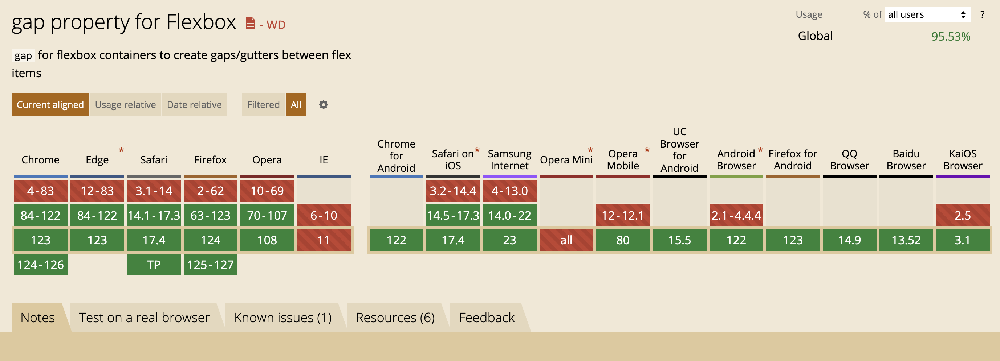
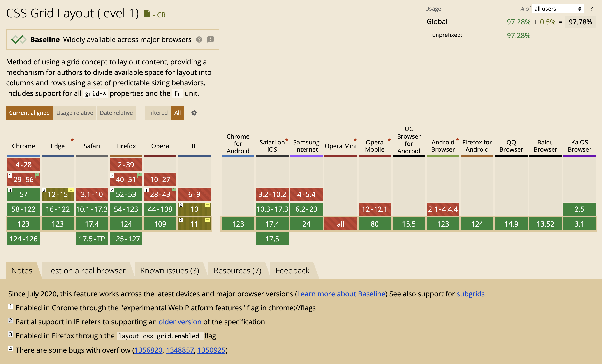

---
---

阅读了“大漠”大佬的掘金小册[《现代Web布局》](https://juejin.cn/book/7161370789680250917)做一些笔记，虽然小册中的很多布局方式经常在用，但还没有系统总结于是做了一下整理

# 逻辑属性

之前不知道逻辑属性，看了小册子对于多语言开发的介绍才了解到，记录一下常用的：

```css
.box {
  inline-size: 100px; /* width */
  block-size: 100px; /* height */

  margin-block-start: 9px; /* margin-top */
  margin-block-end: 9px; /* margin-bottom */
  margin-inline-start: 9px; /* margin-left */
  margin-inline-end: 9px; /* margin-right */

  padding-block-start: 9px; /* padding-top */
  padding-block-end: 9px; /* padding-bottom */
  padding-inline-start: 9px; /* padding-left */
  padding-inline-end: 9px; /* padding-right */

  border-block-start: 9px; /* border-top */
  border-block-end: 9px; /* border-bottom */
  border-inline-start: 9px; /* border-left */
  border-inline-end: 9px; /* border-right */

  border-start-start-radius: 9px; /* border-top-left-radius */
  border-start-end-radius: 9px; /* border-top-right-radius */
  border-end-start-radius: 9px; /* border-bottom-left-radius */
  border-end-end-radius: 9px; /* border-bottom-right-radius */

  text-align: start; /* text-align: left; */
  text-align: end; /* text-align: right; */
}
```

也许和之前一样从上右下左理解不太好，从属性的 `start` 和 `end` 来理解和记忆更容易

# Flex

FlexBox 布局提供了用于对齐 Flex 项目和项目之间分配的属性，这些属性可以分为两大类，分别是**空间分配属性**和**对齐属性**

空间属性主要有：
* `justify-content` 主轴分配 Flex 容器的剩余空间
* `align-content` 侧轴分配 Flex 容器的剩余空间，这个属性只有在设置了 `flex-wrap: wrap` 时，才有效
* `place-content` 是 `justify-content` 和 `align-content` 的简写

对齐属性主要有：
* `align-self` 侧轴对齐单个 Flex 项目
* `align-items` 将所有 Flex 项目作为一个组，沿 Flex 容器侧轴对齐

`justify-` 开头属性主要用于主轴方向，`align-` 开头属性主要用于侧轴方向，`-items` 用于对齐 Flex 项目，`-self` 自身项目对齐，`-content` 主要用于容器空间分配

使用 `gap` 属性来设置项目之间的距离，也可以使用 `margin` 或者 `padding` 来模拟相同效果，而且单独处理样式比较麻烦。需要注意 `gap` 的浏览器兼容情况



如果想要 Flex 所有项目的宽度相等，使用 `flex: 1` 还不行，还必须加上 `min-width: 0` 这个技巧还可以用于 Flex 项目内容过长导致的挤压，如果想要内容太长就显示三个点，或者断句，可以使用这个技巧

# Grid

首先看下浏览器兼容情况


